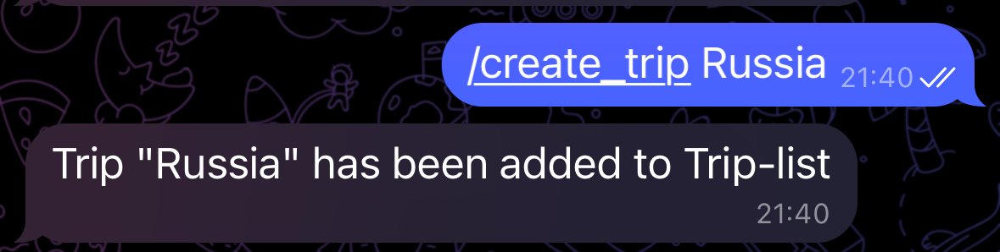

# 🌎Trip-Planner-Bot

## 📋Dependencies
 - TelegramAPI java;
 - Spring REST;
 - Spring JPA;
 - PostgreSQL;

### 💡Common features:
 - Use /help in the telegram bot to run it.

### 💡Features
1. Sign up
2. Sign in
3. Planned trips
  - Show all planned trips
  - Plan a trip (create trip and set points and routes (planes/trains/buses) with dates)
  - Delete planned trip
4. Trip helper
  - Remind about closest trips
  - When trip starts:
    - send location to mark point as visited
    - Mark point manually
    - add notes to point
5. Trips history
  - List all finished trips
  - Show details for specific finished trip
  - Add score for finished trip

---

## 🚀Deploy

Built app is on Docker Hub. See <https://hub.docker.com/r/artemis43rd/trip-planner-bot>.

To use it, specify `services.app.image: artemis43rd/trip-planner-bot` in `docker-compose.yml` instead of `services.app.build`.

```sh
mvn package # requires `docker compose up db` to run generate maven task.
docker compose build
docker compose up
```

## 🎯Commands and using example

### Start page


### Command /start

For a new user, the **/start** command returns "Welcome to Trip Planner Bot!You have been registered as: [your username]".

For already registered users, the **/start** command returns "Welcome back, [your username]! You are already registered".


### Command /help

The **/help** command returns all commands for this bot and an example of their use.


### Command /create_trip

Add trip to the Trip-List. Usage example: **/create_trip** [trip name]



If a trip with the same name has already been created, the bot will respond as follows:


### Command /create_point

Add point to the trip. Usage example: **/create_point** "Trip Name" "Point Name" "Date" "Transport" "Notes (optional)"

Time format: yyyy-MM-dd HH:mm:ss

Example without notes:


Example with notes:


### Command /show_trip_detail

The command **/show_trip_detail** allows you to see all the information about the trip. Usage example: /show_trip_detail "Trip Name"


### Command /show_trips

The command **/show_trips** allows you to get a list of all trips, as well as trips with the Planned/In-Progress/Final status.


### Visited

A point can be marked as visited in two ways: manually and using geolocation.

In order to mark a point manually, you need to use the command **/set_visited_state.** Usage example: /set_visited_state "Trip Name" "Point Name" "Date".

In order to mark a point through geolocation, it is enough for the bot to drop its geolocation. The bot checks whether the point matches the name of the point in the trip with the In-Progress status.  If yes, then the bot will mark the point as visited, if not, it will offer to use the command.

A trip gets a status In-Progress when the time of its starting point falls at the current moment.


### Command /show_score

**/show_score** show user's finished trip score. 


### Command /delete_point

Delete point from the trip


### Command /delete_trip

Delete trip from the Trip-list


### Command /change_note

Set or change notes for the point. Usage example: **/change_note** "Trip Name" "Point Name" "Date" "Note"


## Reminder

The bot has a 24-hour trip reminder function. The check is carried out once every 12 hours. 

During the check, the bot checks if there is a point with such a time, which will start in less than a day. If there is such a point, then the bot sends a reminder and a countdown.


## Error handling

If the wrong command is entered:


If a non-command is entered:


